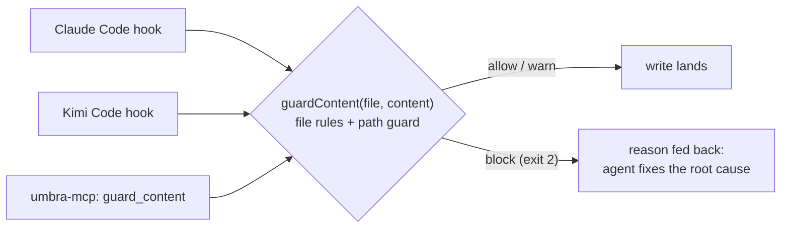

<div align="center">

<picture>
  <source media="(prefers-color-scheme: dark)" srcset="assets/logo.svg">
  <source media="(prefers-color-scheme: light)" srcset="assets/logo-light.svg">
  
</picture>

**Everyone is vibecoding. Nobody is verifying. Umbra scores it.**

Umbra is a deterministic Trust Score (0–100) for AI-generated code: the vibe
coding security scanner that verifies what your agent shipped, not what it
claimed. One command, fully local, evidence for every finding.

[](https://www.npmjs.com/package/@elberacasa/umbra)
[](https://www.npmjs.com/package/@elberacasa/umbra)
[](https://github.com/elberacasa/umbra/stargazers)
[](https://glama.ai/mcp/servers/elberacasa/umbra)
[](https://registry.modelcontextprotocol.io/v0.1/servers?search=io.github.elberacasa/umbra)
[](./LICENSE)
[](https://github.com/elberacasa/umbra/actions/workflows/ci.yml)
[](./RUBRIC.md)
[](https://www.npmjs.com/package/@elberacasa/umbra)

[Quickstart](#quickstart) · [Demo](#demo) · [The Audit](#the-audit-61-vibe-coded-repos-scanned) · [How it works](#how-it-works) · [The Four Axes](#the-four-axes) · [FAQ](#faq) · [Roadmap](#roadmap) · [Contributing](#contributing)

</div>

<a id="demo"></a>


<!--
  DEMO GIF: recorded from demo/demo.tape via charmbracelet/vhs.
  Specs:
    - Terminal recording, 1200x600, dark theme
    - < 25 seconds total runtime
    - Beats per docs/demo-script.md: fresh shell → cd into vibe-coded app →
      `npx @elberacasa/umbra .` → verdict streams in → hold 3s on the final score
    - Render: `cd demo && vhs demo.tape`
  Re-record whenever the verdict format changes; stale demo output is a
  credibility bug (see docs/demo-script.md).
-->

## Why Umbra exists

Studies put exploitable vulnerabilities in 40 to 60 percent of AI-generated
code, and coding agents routinely claim "all tests pass" when three do. The
tooling for *writing* code with AI is a year ahead of the tooling for
*trusting* it. Umbra closes that gap: SAST rebuilt for how software gets
written now, plus sandboxed verification that catches what static rules
cannot.

One command scans any repo an agent produced (Claude Code, Cursor, Copilot,
Windsurf, Lovable) and returns a score with file:line evidence for every
finding. With `--deep` it goes further: Umbra builds and boots the repo in a
locked-down Docker sandbox, then replays the agent's own claims against
reality. If the agent is lying about tests, the score is capped below
passing, with receipts.

## The audit: 61 vibe-coded repos, scanned

We ran Umbra over 61 public, actively-maintained AI-built repos and
published everything. [The Vibe-Coding Security Audit](./docs/vibe-coding-audit-2026-08.md):

| Finding | Repos hit |
|---|---:|
| Hardcoded-secret findings (committed `.env`, service keys in source) | **25%** |
| API routes with no auth check | **26%** |
| Injection sinks (SQL interpolation, unsafe HTML injection) | **49%** |
| Entire databases / SQL dumps committed to git | **13%** |
| At least one critical finding | **10%** |
| Zero scored findings (genuinely clean) | 7 of 61 |

Mean trust score: **74/100**. One in five repos fails outright. The full
report has per-class deep dives with representative snippets and fixes, the
complete per-repo table, and an honest methodology section — including the
false positives we found in our own rules while running it, and fixed
(rubric v4).

## Quickstart

```bash
npx umbra-scan            # check — scans the directory you're standing in
npx umbra-scan --fix      # heal — applies provably-safe fixes, shows the score climbing
npx umbra-scan --setup    # protect — pre-commit gate, PR checks, agent guardrails
```

That's the whole interface. Three verbs: check, heal, protect.

**Using an AI coding agent?** Umbra is built to be driven by agents, not
just run by humans:

- **Any agent** — it reads this repo's [AGENTS.md](./AGENTS.md) / [llms.txt](./llms.txt) and knows what to do. Or tell yours: "check this repo with umbra."
- **Claude Code / Kimi Code** — `--setup` installs PreToolUse hooks so every file the agent writes is guarded before it lands.
- **Claude Code, Cursor, Copilot, Windsurf** — the [trust-review skill](./skills/README.md) makes the agent scan its own work before declaring done.
- **MCP-native agents** — add `umbra-mcp` (`npx --yes -p @elberacasa/umbra umbra-mcp`) and the agent gets `scan_repo`, `guard_content`, and `get_score` as tools.

Real output, scanning a typical vibe-coded Next.js app
([fixtures/bad-app](./fixtures/bad-app) in this repo, Trust Score **30/100**):

```
$ npx @elberacasa/umbra ./fixtures/bad-app

UMBRA TRUST SCORE: 30/100  🔴

SAFE   🔴 5/100 — 15 findings
CLEAN  ✅ 87/100 — 10 findings
RUNS   — not measured — run with --deep
HONEST — not measured — run with --deep

Score computed over measured axes only (full rubric: SAFE 35%, RUNS 25%, HONEST 25%, CLEAN 15%). Rubric v4.
…plus 8 further findings beyond the per-rule cap (see report)

Top findings:
  [safe/hardcoded-secrets] Hardcoded Stripe live secret key in source — .env:3
  [safe/hardcoded-secrets] Hardcoded Supabase service_role JWT — bypasses all row level security — .env:2
  [safe/hardcoded-secrets] Hardcoded Supabase service_role JWT — bypasses all row level security — lib/supabase.ts:5
  [safe/supabase-antipatterns] Supabase service_role key reachable from client-side code — full database bypass for anyone who opens the bundle — .env:2
  [safe/supabase-antipatterns] Supabase service_role key reachable from client-side code — full database bypass for anyone who opens the bundle — app/components/UserList.tsx:10

Notes (low confidence — not scored):
  [safe/missing-rate-limit] Auth endpoint with no rate-limiting signal in the repo — brute-force / credential-stuffing exposure (heuristic) — app/api/login/route.ts:3

Badge: [](https://github.com/elberacasa/umbra)
```

The exit code is **1** when the score is below 50, so CI can gate on it.

<details>
<summary><strong>All commands and flags</strong> (the expert layer — most users never need these)</summary>

```bash
umbra [path]               # path defaults to the current directory
umbra [path] --json        # machine-readable output
umbra [path] --offline     # skip npm registry checks, fully local
umbra [path] --deep        # verify RUNS and HONEST in a Docker sandbox
umbra [path] --report      # write UMBRA.md: an agent-actionable task list
umbra [path] --fix         # apply provably-safe fixes and re-scan (score before → after)
umbra [path] --dry-run     # preview --fix without writing anything
umbra setup                # install everything (hooks + Action + agent guards)
umbra init                 # only the pre-commit hook + GitHub Action
umbra protect              # only the agent PreToolUse hooks (--remove uninstalls)
umbra guard --stdin        # hook entrypoint (agents call this, not humans)
umbra mcp                  # run the MCP server (bin: umbra-mcp)
```

The canonical package is `@elberacasa/umbra`; `umbra-scan` is the short
alias. Same engine either way.

</details>

## How it works

```
repo in
   │
   ▼  Layer 0 · static rules (15 SAFE + CLEAN rules, 0 tokens, <1s)
   ▼  Layer 1 · evidence gating (confidence-scored, low never moves the score)
   ▼  Layer 2 · --deep sandbox (Docker: build, boot, HTTP probe, claim replay)
   │
   ▼  deterministic Trust Score + verdict + badge
```

Every finding carries a confidence level and file:line evidence. Only high
and medium confidence findings move the score; hunches go to a notes section.
The rubric is versioned (currently v3), so the same repo always gets the same
score. Full math in [RUBRIC.md](./RUBRIC.md).

## The immune layer: guard the write, not just the repo

Scanning finds problems after they land. The immune layer checks every file
your agent writes **before** it lands. `umbra protect` installs PreToolUse
hooks into Claude Code and Kimi Code (auto-detected, one command); the same
engine backs the `umbra-mcp` server for MCP-native agents.




```bash
npx umbra-scan protect   # install the hooks; --remove uninstalls cleanly
```

A leaked Stripe key or an `alg: none` JWT never reaches the file. The path
guard hard-blocks agent writes into `.git/hooks` and `.git/config`
([CVE-2026-26268](https://anomity.ai/blog/cursor-git-hooks-sandbox-escape-rce-cve-2026-26268/),
the agent-planted git hook escape), and live credentials going into `.env`.
Blocking is reserved for high-confidence critical/high findings; everything
else warns, and every failure fails open. Verdicts land in ~0.2 ms, so the
guard never slows the agent down. Full story:
[docs/immune-layer.md](./docs/immune-layer.md).

## `--deep`: verify AI code, don't trust it

The fast scan is static. `--deep` is LLM code verification with evidence.
Umbra copies the repo into a throwaway Docker container (no network at
runtime, 512 MB / 1 CPU hard limits, 120-second kill switch), builds it,
boots it, HTTP-probes its endpoints, and replays every claim found in
READMEs and agent artifacts against what actually happens. Slower (minutes,
not seconds) and needs a running Docker daemon. Without Docker the sandboxed
axes are skipped and left out of the score; unverifiable is never punished.

Real output, deep-scanning a repo whose README lies
([fixtures/claims-app](./fixtures/claims-app), capped at **49/100** by the
liar cap):

```
$ npx @elberacasa/umbra ./fixtures/claims-app --deep

UMBRA TRUST SCORE: 49/100  🔴

SAFE   ✅ 100/100 — 0 findings
CLEAN  ✅ 100/100 — 2 findings
RUNS   — not measured — No detectable run path (no Dockerfile, no package.json start script or main entry)
HONEST ⚠️ 50/100 — 2 claims failed, 2 verified, 1 unverifiable

Score computed over measured axes only (full rubric: SAFE 35%, RUNS 25%, HONEST 25%, CLEAN 15%). Rubric v4.
Score capped below passing: a documented claim was verified false. Trust is the product.

Claim receipts:
  CLAIM FAILED: "14 tests pass" — README.md:7 — actually 3 tests pass, 0 fail
  CLAIM FAILED: "build passes" — README.md:9 — actually build exits 1
  CLAIM VERIFIED: "All tests pass" — CLAUDE.md:3 — 3 tests pass
  CLAIM VERIFIED: "All tests are passing" — README.md:8 — 3 tests pass
```

Any claim verified false caps the total at 49: a repo caught lying does not
get a passing trust score. For contrast, a genuinely working app
([fixtures/runnable-app](./fixtures/runnable-app)) scores **100/100** under
`--deep`.

## The Four Axes

| Axis | Question | How it's measured |
|------|----------|-------------------|
| **SAFE** (35%) | Is it vulnerable? | 15 deterministic static rules, every scan, fully offline. |
| **RUNS** (25%) | Does it actually build and boot? | Docker sandbox: install, build, start, HTTP probe. *(`--deep`)* |
| **HONEST** (25%) | Is the agent lying about tests or the build? | Claims extracted from READMEs and agent files, replayed against sandbox reality, receipts emitted. *(`--deep`)* |
| **CLEAN** (15%) | How much is slop? | Static rules: dead exports, unused deps, mega-files, duplication. |

The SAFE rules cover the failures AI-generated code security actually ships:
hardcoded secrets (Stripe keys, JWTs, connection strings), Supabase
service-role keys exposed client-side and missing **Supabase RLS**, missing
auth on API routes, injection sinks, rate-limit hints, hallucinated and
typosquatted dependencies, CORS wildcard with credentials, JWT misconfig
(`alg: none`, no expiry, decode-as-authorization), debug flags and
stack-trace leaks, committed sensitive files (`.pem`, `id_rsa`, SQL dumps),
and default credentials.

## Umbra vs. existing tools

| | Umbra | Traditional SAST (Semgrep, Snyk Code) | Secret scanners (trufflehog, Gitleaks) | Agent review bots |
|---|---|---|---|---|
| Built for AI-generated code | ✅ | generic rulesets | secrets only | ✅ |
| Verifies the app builds, boots, and answers HTTP | ✅ (sandbox) | — | — | — |
| Replays agent claims, caps liars below passing | ✅ | — | — | — |
| Deterministic score, versioned rubric | ✅ | findings list | findings list | prose review |
| Agent-native surfaces (skill, Action, MCP) | ✅ | — | — | partial |

Existing tools answer "is this code pattern dangerous?" Umbra answers the
question vibe coding actually raises: "the AI wrote this, can I trust it?"

## The badge

Every scan prints badge markdown. Paste it in your README and your repo
advertises its own trust score:

```markdown
[](https://github.com/elberacasa/umbra)
```

[](https://github.com/elberacasa/umbra)

## One engine, every surface

- **CLI** (`npx @elberacasa/umbra`): the core, available today. Short alias:
  `npx umbra-scan`.
- **Agent skill**: a [trust-review skill](./skills/README.md) installable
  into Claude Code, Cursor, Copilot, and Windsurf, so the agent checks its
  own work before you do. Claude Code / Cursor / Copilot security, from
  inside the agent.
- **GitHub Action**: [`uses: elberacasa/umbra@v1`](./action.yml) comments the
  Trust Score on every PR. Trust gating in CI, zero local setup.
- **`umbra setup`**: the one-word installer — pre-commit gate, PR score
  comments, and PreToolUse guard hooks for detected agents, all idempotent
  and clobber-free. (`init` and `protect` remain for piecemeal installs.)
- **`umbra protect`**: installs PreToolUse hooks into Claude Code and Kimi
  Code (auto-detected, idempotent, `--remove` to uninstall) so Umbra reviews
  every agent write mid-stream and blocks dangerous ones before they land.
- **MCP server** (`umbra-mcp`): agents call Umbra mid-stream and catch their
  own mistakes before the code lands. Add it with
  `npx --yes -p @elberacasa/umbra umbra-mcp`.

Day-to-day recipes (CI gating, JSON parsing, hooks): [docs/daily-use.md](./docs/daily-use.md).

## Roadmap

- **v0.1** *(shipped)*: CLI, SAFE + CLEAN static axes, deterministic score, verdict output, badge markdown.
- **v0.2** *(shipped)*: the surfaces. Agent skill, GitHub Action, `umbra init`.
- **v0.3** *(shipped, current)*: RUNS axis (sandbox build, boot, HTTP probe) and HONEST axis (claim receipts plus the liar cap).
- **v1.0** *(shipped)*: the immune layer. Umbra sits between the agent and your codebase, intercepting writes mid-stream and scoring them before they land. Full story in [docs/immune-layer.md](./docs/immune-layer.md).
- **Beyond**: attack graphs across your dependency tree, a security twin of your app that gets probed so production doesn't, hosted report permalinks behind every badge.

The wedge is a score. The destination is the verification layer every
AI-built repo runs through.

## FAQ

**How is Umbra different from Semgrep, Snyk, or trufflehog?**
They scan code patterns; Umbra verifies outcomes. Static rules are one input
to the SAFE axis. Umbra additionally boots the app in a sandbox to prove it
runs, and replays the agent's documented claims to prove it isn't lying.
"README says 14 tests pass, actually 3 do" costs the repo a passing grade.

**Does Umbra send my code anywhere?**
No. Scanning is fully local; `--offline` skips even the npm registry checks.
`--deep` runs your repo in a local Docker container with no network at
runtime. Nothing leaves your machine.

**Does it need Docker?**
Only for `--deep` (RUNS and HONEST). The default fast scan is pure static
analysis. Without Docker the sandboxed axes are skipped and excluded from the
score, never punished.

**What languages does it support?**
JavaScript and TypeScript (including Next.js and Supabase apps) have the
deepest coverage today, which is where most vibe-coded repos live. The rule
engine is extensible; new rules need a fixture and a test.

**Is the score reproducible?**
Yes. Same repo, same rubric version, same score, every time. The rubric is
versioned (v2) and printed in every report, and low-confidence findings never
affect it. Skipped axes are excluded and renormalized over, never punished.

**What does it catch that my AI agent won't mention?**
The classics of AI-generated code: a Supabase `service_role` JWT shipped to
the browser (bypasses all row level security), live Stripe keys in `.env`,
API routes with no auth check, `alg: none` JWTs, CORS `*` with credentials,
hallucinated dependencies that don't exist on npm, and whether its own claims
about tests and builds are true.

**Can Umbra stop my agent mid-write?**
Yes, via hooks. Run `npx @elberacasa/umbra protect` and Umbra installs a
PreToolUse hook into Claude Code and/or Kimi Code that reviews every
`Write`/`Edit`/`MultiEdit` before it lands. Only high-confidence critical and
high severity findings block (a wrong block gets tools uninstalled, so when
in doubt Umbra warns), the `.git/hooks` path guard blocks git-hook planting
(CVE-2026-26268) outright, and the guard fails open on its own errors so it
never breaks your flow. Hooks are a guardrail, not a sandbox; details in
[docs/immune-layer.md](./docs/immune-layer.md).

**Can my AI coding agent use Umbra directly?**
Yes, that is the design. The repo ships an [AGENTS.md](./AGENTS.md) and
[llms.txt](./llms.txt) so assistants know exactly when and how to run it, and
the [agent skill](./skills/README.md) makes Claude Code, Cursor, Copilot, and
Windsurf scan their own work before declaring a task done.

## Contributing

Issues and PRs welcome. See [CONTRIBUTING.md](./CONTRIBUTING.md). The
highest-value contributions right now: new SAFE/CLEAN rules with fixtures and
tests, false-positive reports (severity-one bugs here), renders against real
AI-generated repos, and new harness adapters for `umbra protect`.

Build and test before submitting:

```bash
npm install
npm run build
npm test
```

## Ethical use

Umbra is a defensive tool. Scan repos you own, repos you are about to depend
on, or repos you have permission to audit. Findings point at weaknesses; they
are not exploits, and publishing someone else's low score to shame them is
not the point. The point is that "the AI wrote it" stops being the end of the
verification conversation.

## License

[MIT](./LICENSE)
